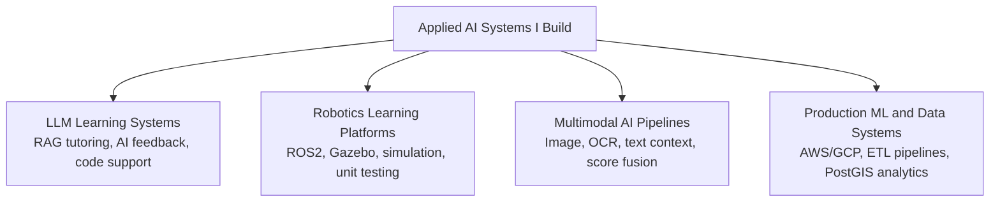

# Hi, I'm Ponkoj Shill

**AI/ML Engineer and PhD Candidate building LLM-powered learning systems, robotics platforms, multimodal AI pipelines, and production ML/data systems.**

[](https://www.linkedin.com/in/ponkoj-chandra-shill-54201417a/)
[](https://scholar.google.com/citations?user=Wfm3Z_YAAAAJ&hl=en)
[](mailto:csponkoj@gmail.com)

I build applied AI systems that connect models, data, software, and real users. My work spans LLM-based tutoring, robotics education platforms, multimodal AI, computer vision, biomedical machine learning, cloud ML pipelines, geospatial analytics, and data engineering.

I am currently a final-year PhD candidate in Computer Science at the University of Nevada, Reno, working in the Robotics Research Lab on NSF-funded AI-assisted education and personalized robotics learning systems.

## Explore More

| Section | Link |
|---|---|
| Project Portfolio | [View Projects](./projects.md) |
| Research and Publications | [View Research](./research.md) |
| Industry and Engineering Work | [View Experience](./experience.md) |

## What I Build



## Selected Impact

- Built an **LLM-powered intelligent tutoring system** using RAG, prompt engineering, and OpenAI APIs for an NSF-funded AI education project
- Developed an interactive robotics learning platform using **ROS2, Gazebo, Flask, Flutter, browser-based coding, unit testing, and AI feedback**
- Deployed AI-assisted learning components to **100+ students**; co-authored **6+ peer-reviewed papers** with **120+ citations**
- Built production-style ML and data pipelines using **AWS, GCP, PostgreSQL, PostGIS, ETL workflows, APIs, and web scraping**
- Processed **8M+ real-estate images** and analyzed **4M property records** across **100+ geographical risk zones**

## Featured Projects

| Area | Project | What it Shows | Details |
|---|---|---|---|
| AI Education | AI-Assisted Robotics Learning Platform | LLM tutoring, automated feedback, simulation-based coding | [Read case study](./docs/ai-assisted-robotics-platform.md) |
| Multimodal AI | Hate and Threat Detection in Digital Forensics | Image, OCR, text context, zero-shot classification, score fusion | [Read case study](./docs/multimodal-forensics-ai.md) |
| Production ML | Real Estate Valuation System | Computer vision, tabular ML, cloud pipelines, geospatial analytics | [Read case study](./docs/production-ml-real-estate.md) |
| Biomedical AI | Pump Prediction and Control Optimization | Time-series ML, optimization, calibration automation | [Read case study](./docs/biomedical-ml.md) |
| Python Tooling | pandas_eda_check | PyPI package development and practical data inspection | [Read case study](./docs/pandas-eda-check.md) |

See the full portfolio here: [projects.md](./projects.md).

## Public Repositories

### Hate and Threat Detection in Digital Forensics

A multimodal AI pipeline for forensic evidence analysis using image evidence, OCR text, associated textual context, zero-shot classification, and score-level fusion.

**Tech:** Python, OpenCLIP, Hugging Face Transformers, OCR, pandas, pytest  
**Repository:** [Hate-and-Threat-Detection-in-Forensics](https://github.com/CS-Ponkoj/Hate-and-Threat-Detection-in-Forensics)

### pandas_eda_check

A lightweight Python package for fast exploratory data analysis with pandas.

```bash
pip install pandas-eda-check
```

**Tech:** Python, pandas, PyPI packaging  
**Repository:** [pandas_eda_check](https://github.com/CS-Ponkoj/pandas_eda_check)  
**PyPI:** [pypi.org/project/pandas-eda-check](https://pypi.org/project/pandas-eda-check)

[](https://badge.fury.io/py/pandas-eda-check)

## Technical Stack

| Area | Tools and Technologies |
|---|---|
| AI/ML | PyTorch, TensorFlow, scikit-learn, Hugging Face, OpenCLIP, OpenAI APIs, RAG, LLMs, Generative AI, Computer Vision |
| Robotics | ROS, ROS2, Gazebo, Webots, Raspberry Pi, sensor-based systems, simulation-based learning |
| Backend and Apps | Python, Flask, REST APIs, Flutter, Dart |
| Data and Analytics | SQL, pandas, NumPy, PostgreSQL, MySQL, MongoDB, Power BI, Tableau |
| Cloud and Data Engineering | AWS S3, Lambda, EC2, RDS, GCP, ETL pipelines, data warehousing, web scraping, PostGIS |
| Tools | Git, Linux, Docker, Jupyter, Google Colab, VS Code |

## Roles I Am Interested In

I am interested in AI/ML Engineer, Research Engineer, Applied Scientist, LLM Engineer, Multimodal AI Engineer, Robotics Software Engineer, and Data Scientist roles.

I enjoy building systems where models, data, software, and people come together in real workflows.


