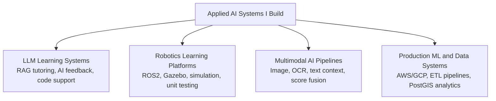
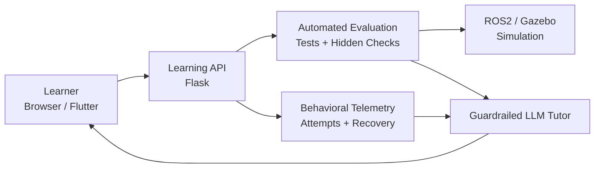

# Ponkoj Chandra Shill

**AI/ML Researcher · Ph.D. Candidate in Computer Science**

I develop intelligent learning and production AI systems that combine automated evaluation, behavioral telemetry, simulation, multimodal evidence, and guardrailed LLM feedback.

Available for **AI/ML research, applied scientist, and machine learning engineering roles beginning January 2027**.

🌐 **Website:** [ponkoj.com](https://ponkoj.com/)

## Evidence at a Glance

| Research | Applied Impact | Production Scale |
|---|---|---|
| **6 peer-reviewed papers** | **100+ students** supported by an AI-assisted learning platform | **8M+ images** processed |
| **160+ citations** | **50%** reduction in biomedical pump calibration effort | **4M+ property records** analyzed |
| **NSF-funded research** | **15%** improvement in customer retention | **100+ geospatial risk zones** evaluated |

*Citation count current as of July 2026.*

## What I Build

```mermaid
flowchart TB
    A["Applied AI Systems I Build"]

    A --> B["LLM Learning Systems<br/>RAG tutoring, AI feedback, code support"]
    A --> C["Robotics Learning Platforms<br/>ROS2, Gazebo, simulation, unit testing"]
    A --> D["Multimodal AI Pipelines<br/>Image, OCR, text context, score fusion"]
    A --> E["Production ML and Data Systems<br/>AWS/GCP, ETL pipelines, PostGIS analytics"]
```

## Featured Work

| System | What I Built | Evidence |
|---|---|---|
| **AI-Assisted TDD for Robotics Learning** | Automated evaluation, behavioral telemetry, ROS2/Gazebo simulation, and guardrailed LLM tutoring | [Case study](./docs/ai-assisted-robotics-platform.md) · [IEEE paper](https://doi.org/10.1109/FIE61694.2024.10893417) |
| **AI-Assisted PCB Design** | Natural-language requirements transformed into validated BOM, pin map, netlist, power budget, and interactive design review | [Case study](./docs/ai-assisted-pcb-design.md) · [Live demo](https://ai-assisted-pcb-design.streamlit.app/) · [Repository](https://github.com/CS-Ponkoj/AI-Assisted-PCB-Design) |
| **Multimodal Digital Forensics** | OCR, OpenCLIP, DeBERTa, modality-aware routing, and auditable score fusion | [Case study](./docs/multimodal-forensics-ai.md) · [Repository](https://github.com/CS-Ponkoj/Hate-and-Threat-Detection-in-Forensics) |
| **Property Valuation and Geospatial Risk** | CatBoost valuation, ResNet152V2 classification, PostGIS analytics, and AWS ETL pipelines | [Case study](./docs/production-ml-real-estate.md) · [Experience](./experience.md#machine-learning-engineer--data-team-lead) |
| **pandas-eda-check** | Reusable data-quality reports and dataset profile comparison for schema, quality, numeric, datetime, and categorical changes | [Case study](./docs/pandas-eda-check.md) · [PyPI](https://pypi.org/project/pandas-eda-check/) · [Repository](https://github.com/CS-Ponkoj/pandas_eda_check) |

## Evidence-Backed Capabilities

| Capability | Selected Evidence |
|---|---|
| **Intelligent Learning Systems** | Automated tests, hidden checks, learning telemetry, simulation, and LLM tutoring in an NSF-funded research platform |
| **Generative AI and Engineering Automation** | Gemini/Ollama requirement extraction, deterministic validation, structured hardware artifacts, and review workflows |
| **Multimodal AI and Digital Forensics** | OCR, vision-language models, transformer text analysis, evidence routing, and score fusion |
| **Predictive and Geospatial Intelligence** | CatBoost, PostgreSQL/PostGIS, AWS processing, and multimillion-record property workflows |
| **Computer Vision and Robotics** | ResNet152V2, ROS2, Gazebo, embedded systems, simulation, and human-robot interaction |
| **Open-Source Data and ML Tooling** | Published PyPI package with tests and CI for data-quality assessment and profile comparison |

## AI-Assisted Robotics Learning System

```mermaid
flowchart LR
    A["Learner<br/>Browser / Flutter"] --> B["Learning API<br/>Flask"]
    B --> C["Automated Evaluation<br/>Tests + Hidden Checks"]
    C --> D["ROS2 / Gazebo<br/>Simulation"]
    B --> E["Behavioral Telemetry<br/>Attempts + Recovery"]
    C --> F["Guardrailed LLM Tutor"]
    E --> F
    F --> A
```

**Built:** evaluation, telemetry, simulation, and tutoring workflows 
**Measures:** accuracy, efficiency, recovery, robustness, and learner experience 
**Status:** platform developed; experimental evaluation in progress

## Selected Experience

- **Graduate Research Assistant, University of Nevada, Reno** · Aug 2022–Present 
  Developing an NSF-funded AI/ML learning and assessment platform and publishing research on automated evaluation and personalized robotics education.
- **Business Intelligence Developer, Tahoe Forest Health System** · Mar 2026–Jul 2026 
  Built dashboards, SQL datasets, data models, and repeatable ETL/data-quality workflows for healthcare operations.
- **AI Software Engineer Intern, Consynsys Technologies** · Jan 2024–May 2024 
  Developed biomedical time-series forecasting, optimization, predictive maintenance, and cloud AI workflows.
- **Machine Learning Engineer / Data Team Lead, Softwrd Ltd** · Jun 2021–Aug 2022 
  Led multimodal property valuation, computer vision, geospatial intelligence, and large-scale cloud data processing.

[View complete experience](./experience.md) · [View full résumé](https://ponkojshill.csponkoj.chatgpt.site/resume)

## Selected Publications

1. **WIP: A Unit Testing Framework for Self-Guided Personalized Online Robotics Learning**: First author, IEEE FIE 2024. [DOI](https://doi.org/10.1109/FIE61694.2024.10893417)
2. **Undergraduate Robotics Education with General Instructors Using a Student-Centered Personalized Learning Framework**: Co-author, ASEE 2024. [Paper](https://peer.asee.org/47002)
3. **A Schedule of Duties in the Cloud Space Using a Modified Salp Swarm Algorithm**: Co-author, IFIP IoT 2023. [DOI](https://doi.org/10.1007/978-3-031-45878-1_5)
4. **Multi-modal Hate Speech Detection Using Machine Learning**: Co-author, IEEE Big Data 2021. [DOI](https://doi.org/10.1109/BigData52589.2021.9671955)

[View research and publication details](./research.md) · [View complete Google Scholar profile](https://scholar.google.com/citations?user=Wfm3Z_YAAAAJ&hl=en)

## Technical Expertise

### Core Specialties

- **LLM and generative AI systems:** RAG, prompt engineering, guardrails, structured generation, source-grounded feedback, and model-assisted engineering workflows
- **Multimodal AI and computer vision:** vision-language models, OCR, transformer-based text analysis, evidence routing, score fusion, and image classification
- **Predictive ML and experimentation:** regression, time-series forecasting, optimization, feature engineering, hypothesis-driven evaluation, and statistical analysis
- **Robotics and intelligent learning:** ROS2/Gazebo simulation, automated assessment, behavioral telemetry, personalized feedback, and test-driven learning workflows
- **Production data and geospatial systems:** cloud processing, ETL, data-quality validation, PostgreSQL/PostGIS analytics, APIs, monitoring, and operational reporting

### Selected Technologies

**Languages and software:** `Python` · `SQL` · `C++` · `Flask` · `REST APIs` · `Streamlit` · `Flutter`

**AI and modeling:** `PyTorch` · `TensorFlow` · `scikit-learn` · `Hugging Face` · `OpenCLIP` · `DeBERTa` · `CatBoost`

**Cloud and data:** `AWS` · `GCP` · `PostgreSQL` · `PostGIS` · `MySQL` · `MongoDB` · `Microsoft Fabric`

**Engineering practice:** `Experiment Design` · `Model Evaluation` · `TDD` · `Unit Testing` · `Regression Testing` · `Git` · `Linux` · `Technical Documentation`

## Explore

  
  &nbsp;&nbsp;&nbsp;&nbsp;
  

  
  &nbsp;&nbsp;&nbsp;&nbsp;
  

  
  &nbsp;&nbsp;&nbsp;&nbsp;
  

## Contact

**Research questions deserve working systems.**

[Email](mailto:csponkoj@gmail.com) · [LinkedIn](https://www.linkedin.com/in/ponkoj) · [GitHub](https://github.com/CS-Ponkoj) · [Google Scholar](https://scholar.google.com/citations?user=Wfm3Z_YAAAAJ&hl=en)

## Author

**Ponkoj Shill**  
AI/ML researcher and Ph.D. candidate in Computer Science

- [GitHub](https://github.com/CS-Ponkoj)
- [Portfolio](https://ponkoj.com)

## License

No license file is currently included. Please contact the author before reusing the repository beyond review, education, or fair-use evaluation.
