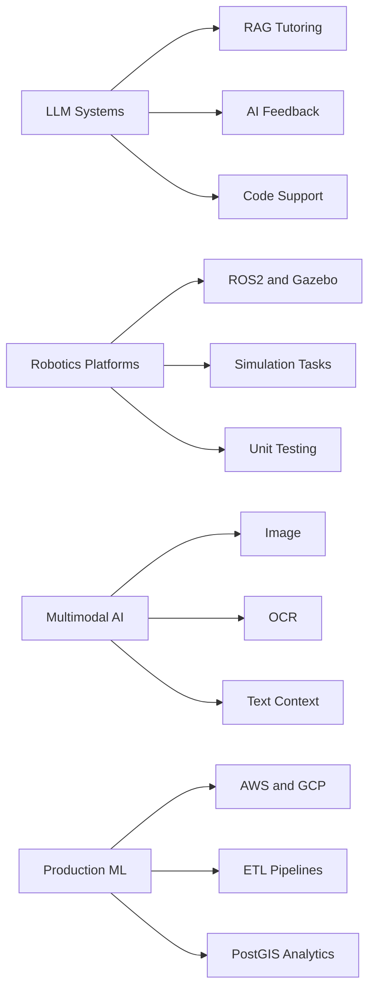

# Hi, I'm Ponkoj Shill

**AI/ML Engineer and PhD Candidate building LLM-powered learning systems, robotics platforms, multimodal AI pipelines, and production ML/data systems.**

[](https://www.linkedin.com/in/ponkoj-chandra-shill-54201417a/)
[](https://scholar.google.com/citations?user=Wfm3Z_YAAAAJ&hl=en)
[](mailto:csponkoj@gmail.com)

I build applied AI systems that connect models, data, software, and real users. My work spans LLM-based tutoring, robotics education platforms, multimodal AI, computer vision, biomedical machine learning, cloud ML pipelines, and data engineering.

I am currently a final-year PhD candidate in Computer Science at the University of Nevada, Reno, working in the Robotics Research Lab on NSF-funded AI-assisted education and personalized robotics learning systems.

---

## What I Build



---

## Selected Impact

- Built an **LLM-powered intelligent tutoring system** using RAG, prompt engineering, and OpenAI APIs for an NSF-funded AI education project
- Developed an interactive robotics learning platform using **ROS2, Gazebo, Flask, Flutter, browser-based coding, unit testing, and AI feedback**
- Deployed AI-assisted learning components to **100+ students**; co-authored **6+ peer-reviewed papers** with **120+ citations**
- Built production-style ML and data pipelines using **AWS, GCP, PostgreSQL, PostGIS, ETL workflows, APIs, and web scraping**
- Processed **8M+ real-estate images** and analyzed **4M property records** across **100+ geographical risk zones**

---

## Project Snapshot

| Area | Project | What it Shows | Stack |
|---|---|---|---|
| Multimodal AI | Hate and Threat Detection in Digital Forensics | Image, OCR, text context, zero-shot classification, score fusion | Python, OpenCLIP, Transformers, OCR |
| Python Tooling | pandas_eda_check | PyPI package development and practical data inspection | Python, pandas, PyPI |
| AI Education | AI-Assisted Robotics Learning Platform | LLM tutoring, automated feedback, simulation-based coding | Flask, Flutter, ROS2, Gazebo |
| Production ML | Real Estate Valuation System | Computer vision, tabular ML, cloud data pipelines, geospatial analytics | AWS, TensorFlow, CatBoost, PostGIS |
| Biomedical AI | Pump Prediction and Control Optimization | Time-series ML, genetic algorithms, calibration automation | Python, ML, optimization |
| Analytics | Business Intelligence and Data Analytics | Dashboards, retention analysis, decision support | SQL, Tableau, Power BI |

---

## Featured Public Projects

### Hate and Threat Detection in Digital Forensics

A multimodal AI pipeline for forensic evidence analysis using image evidence, OCR text, associated textual context, zero-shot classification, and score-level fusion.

- Built a modality-aware pipeline for image-only, OCR-based, and image-plus-context evidence analysis
- Used OpenCLIP, transformer-based zero-shot classification, frozen labels, structured outputs, and reproducible experiment scripts

**Tech:** Python, OpenCLIP, Hugging Face Transformers, OCR, pandas, pytest  
**Repository:** [Hate-and-Threat-Detection-in-Forensics](https://github.com/CS-Ponkoj/Hate-and-Threat-Detection-in-Forensics)

---

### pandas_eda_check

A lightweight Python package for fast exploratory data analysis with pandas.

- Published an installable Python package for quick inspection of missing values, unique values, and column completeness
- Designed as a reusable utility for messy tabular datasets and early-stage data analysis

**Install**

```bash
pip install pandas-eda-check
```

**Tech:** Python, pandas, PyPI packaging  
**Repository:** [pandas_eda_check](https://github.com/CS-Ponkoj/pandas_eda_check)  
**PyPI:** [pypi.org/project/pandas-eda-check](https://pypi.org/project/pandas-eda-check)

[](https://badge.fury.io/py/pandas-eda-check)

---

## Selected Research and Industry Engineering Work

### AI-Assisted Robotics Learning Platform

A research-driven platform for robotics and programming education that combines structured learning content, browser-based coding, simulation, automated feedback, and LLM-based support.

- Built a Flask and Flutter platform with ROS2/Gazebo simulation, browser-based coding, real-time unit testing, and AI feedback
- Designed learning analytics around code accuracy, attempts, stuck states, iteration behavior, and student improvement

**Tech:** Python, Flask, Flutter, ROS2, Gazebo, OpenAI APIs, unit testing, learning analytics

---

### Production ML and Real Estate Valuation System

An end-to-end machine learning system for real estate valuation and property intelligence using computer vision, tabular modeling, geospatial analysis, and cloud infrastructure.

- Built image classification and valuation pipelines using ResNet152V2, CatBoost, AWS Lambda, AWS S3, and AWS RDS
- Processed 8M+ property images and analyzed 4M property records across 100+ geographical risk zones using PostgreSQL and PostGIS

**Tech:** Python, CatBoost, ResNet152V2, TensorFlow, AWS Lambda, AWS S3, AWS RDS, PostgreSQL, PostGIS

---

### Biomedical Time-Series ML and Control Optimization

A machine learning and optimization project focused on biomedical pump liquid transfer prediction and calibration automation.

- Developed time-series ML models to predict liquid transfer behavior in biomedical pumps
- Applied genetic algorithms and benchmarking workflows to reduce manual calibration effort by 50%

**Tech:** Python, time-series modeling, genetic algorithms, benchmarking, monitoring

---

### Business Intelligence and Data Analytics

Data analytics and BI work focused on customer behavior, supply-demand patterns, automation, and decision support.

- Built data analysis workflows and dashboards using Python, SQL, Tableau, and Power BI
- Supported customer retention, business strategy, geographical analysis, and operational decision-making

**Tech:** Python, SQL, MySQL, Tableau, Power BI, data analysis

---

## Research Focus

My research focuses on AI-assisted STEM education, robotics learning, adaptive feedback systems, LLM-driven tutoring, simulation-based learning, and multimodal AI.

I am especially interested in intelligent systems that support learning, decision-making, and human-centered AI applications.

**Google Scholar:** [Ponkoj Shill](https://scholar.google.com/citations?user=Wfm3Z_YAAAAJ&hl=en)

---

## Technical Stack

| Area | Tools and Technologies |
|---|---|
| AI/ML | PyTorch, TensorFlow, scikit-learn, Hugging Face, OpenCLIP, OpenAI APIs, RAG, LLMs, Generative AI, Computer Vision |
| Robotics | ROS, ROS2, Gazebo, Webots, Raspberry Pi, sensor-based systems, simulation-based learning |
| Backend and Apps | Python, Flask, REST APIs, Flutter, Dart |
| Data and Analytics | SQL, pandas, NumPy, PostgreSQL, MySQL, MongoDB, Power BI, Tableau |
| Cloud and Data Engineering | AWS S3, Lambda, EC2, RDS, GCP, ETL pipelines, data warehousing, web scraping, PostGIS |
| Tools | Git, Linux, Docker, Jupyter, Google Colab, VS Code |

---

## Roles I Am Interested In

I am interested in AI/ML Engineer, Research Engineer, Applied Scientist, LLM Engineer, Multimodal AI Engineer, Robotics Software Engineer, and Data Scientist roles.

I enjoy building systems where models, data, software, and people come together in real workflows.

---

## GitHub Snapshot


