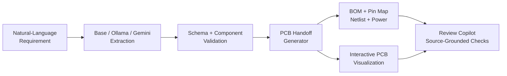

# AI-Assisted PCB Design

[Back to Projects](../projects.md) · [Back to README](../README.md) · [Live demo](https://ai-assisted-pcb-design.streamlit.app/) · [Repository](https://github.com/CS-Ponkoj/AI-Assisted-PCB-Design)

| | |
|---|---|
| **Type** | Public generative-engineering prototype |
| **Role** | Designer and developer |
| **Timeline** | May 2026–Present |
| **Status** | Live public system |

## Problem

Natural-language hardware requests are ambiguous, while unconstrained LLM output can invent components, connections, or unsupported capabilities. Engineering handoff requires explicit structure, validation, traceability, and clear failure states.

## System

The application converts a sensor-board request into validated engineering artifacts using controlled parsing or optional LLM extraction.

## What I Built

- Folder-based sensor definitions and validation for supported components
- Deterministic base parsing plus optional Ollama and Gemini extraction modes
- Fallback behavior that keeps the application usable when an external model is unavailable
- Structured BOM, pin map, netlist, power budget, schematic notes, layout notes, and build checks
- Interactive PCB visualization with component/trace inspection, dimensions, antenna keepout, and mounting-hole coordinates
- Source-grounded PCB review with Gemini support and deterministic local checks
- CSV, Markdown, and JSON exports
- Tests and explicit rejection of unsupported requests rather than fabricated hardware

## Technology

Python, Streamlit, Gemini API, Ollama, Graphviz, structured validation, pytest.

## Evidence

- [Try the live Streamlit application](https://ai-assisted-pcb-design.streamlit.app/)
- [Review the public source and tests](https://github.com/CS-Ponkoj/AI-Assisted-PCB-Design)
