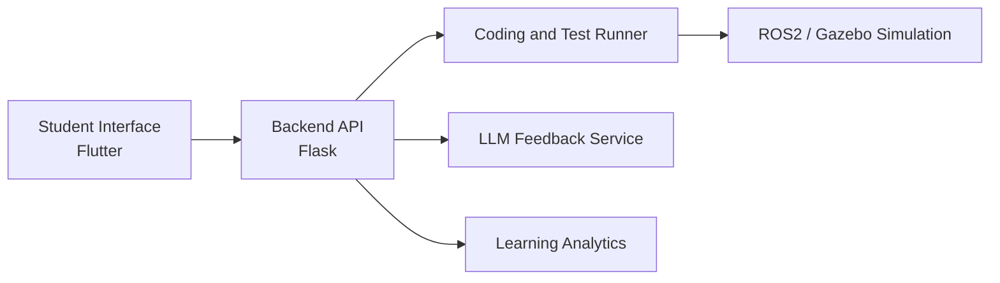

# AI-Assisted Robotics Learning Platform

[Back to Projects](../projects.md) | [Back to README](../README.md)

## Overview

A research-driven platform for robotics and programming education that combines structured learning content, browser-based coding, simulation, automated feedback, and LLM-based support.

## Problem

Robotics learners often need timely feedback while writing code, running simulations, and debugging behavior. Traditional lab support does not always scale well when students get stuck on syntax, logic, robotics concepts, or simulation setup.

## What I Built

- Built a Flask and Flutter platform for interactive robotics learning
- Integrated ROS2 and Gazebo for simulation-based robotics exercises
- Supported browser-based coding and real-time unit testing
- Developed LLM-based feedback workflows using prompt engineering and OpenAI APIs
- Designed learning analytics around code accuracy, attempts, stuck states, iteration behavior, and student improvement

## Architecture

## Tech Stack

Python, Flask, Flutter, Dart, ROS2, Gazebo, OpenAI APIs, unit testing, learning analytics.

## Impact

- Supported AI-assisted robotics learning for 100+ students
- Connected LLM tutoring, simulation, code execution, and analytics in a single learning workflow
- Contributed to NSF-funded AI-assisted education research
