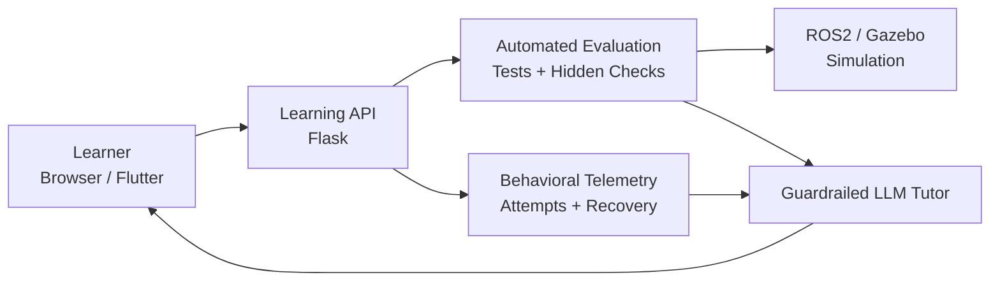

# AI-Assisted TDD for Robotics Learning

[Back to Projects](../projects.md) · [Back to README](../README.md) · [Related IEEE paper](https://doi.org/10.1109/FIE61694.2024.10893417)

| | |
|---|---|
| **Context** | NSF-funded research, University of Nevada, Reno |
| **Role** | Graduate Research Assistant |
| **Timeline** | Aug 2022–Present |
| **Users** | 100+ students |
| **Status** | Platform developed; experimental evaluation in progress |

## Problem

Robotics learners need timely, contextual help while writing code, interpreting test failures, running simulations, and debugging robot behavior. Traditional lab support does not always scale, while unrestricted generative-AI answers can bypass the learning process.

## System

The platform combines structured content, browser-based programming, automated evaluation, behavioral telemetry, ROS2/Gazebo simulation, and guardrailed LLM tutoring in one learning workflow.

```mermaid
flowchart LR
    A["Learner<br/>Browser / Flutter"] --> B["Learning API<br/>Flask"]
    B --> C["Automated Evaluation<br/>Tests + Hidden Checks"]
    C --> D["ROS2 / Gazebo<br/>Simulation"]
    B --> E["Behavioral Telemetry<br/>Attempts + Recovery"]
    C --> F["Guardrailed LLM Tutor"]
    E --> F
    F --> A
```

## What I Built

- Python-based automated evaluation with unit tests, hidden checks, pattern recognition, and real-time failure analysis
- Behavioral telemetry for pass rates, attempts, time-to-recovery, edit-run cycles, stuck states, and learning outcomes
- ROS2 and Gazebo workflows for simulation-supported robotics exercises
- NLP and LLM pipelines that analyze code and learning context and provide guidance without exposing final solutions
- Personalized analytics and recommendation workflows for learners, instructors, and research evaluation
- Demonstrations, technical documentation, peer-reviewed papers, and stakeholder communication

## Evaluation

**Measures:** accuracy, efficiency, recovery, robustness, and learner experience

The research uses hypothesis-driven evaluation across system and learning outcomes. Platform development is complete; experimental evaluation is in progress, so this case study does not present preliminary results as final conclusions.

## Technology

Python, Flask, Flutter, Dart, ROS2, Gazebo, OpenAI APIs, prompt engineering, automated testing, learning analytics, statistical analysis.

## Evidence

- [IEEE FIE 2024: Unit Testing Framework for Self-Guided Personalized Online Robotics Learning](https://doi.org/10.1109/FIE61694.2024.10893417)
- [ASEE 2024: Student-Centered Personalized Robotics Learning Framework](https://peer.asee.org/47002)
- [Research and publication record](../research.md)
