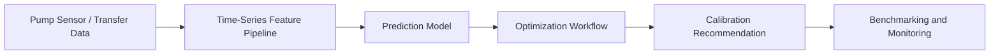

# Biomedical Time-Series ML and Control Optimization

[Back to Projects](../projects.md) | [Back to README](../README.md)

## Overview

A machine learning and optimization project focused on biomedical pump liquid transfer prediction and calibration automation.

## Problem

Biomedical pump calibration can require repeated manual experimentation and tuning. The project focused on predicting liquid transfer behavior and reducing manual calibration effort.

## What I Built

- Developed time-series ML models to predict liquid transfer behavior in biomedical pumps
- Applied genetic algorithms for control optimization
- Built benchmarking workflows to evaluate calibration performance
- Used monitoring and analysis workflows to compare model and system behavior

## Architecture

## Tech Stack

Python, time-series modeling, genetic algorithms, benchmarking, monitoring.

## Impact

- Reduced manual calibration effort by 50%
- Connected prediction, optimization, and benchmarking for practical biomedical system support
