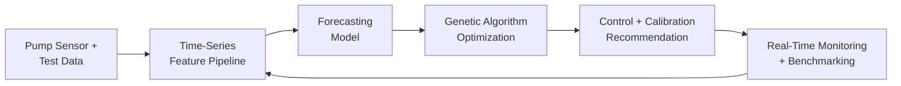

# Biomedical Pump Prediction and Control Optimization

[Back to Projects](../projects.md) · [Back to README](../README.md) · [Professional experience](../experience.md#ai-software-engineer-intern)

| | |
|---|---|
| **Context** | AI software engineering internship, Consynsys Technologies |
| **Role** | AI Software Engineer Intern |
| **Timeline** | Jan 2024–May 2024 |
| **Status** | Professional project; implementation details summarized without proprietary source |

## Problem

Biomedical pump calibration required repeated manual experiments and tuning. The engineering goal was to predict liquid-transfer behavior, optimize control settings, monitor performance, and reduce calibration effort.

## System

```mermaid
flowchart LR
    A["Pump Sensor +<br/>Test Data"] --> B["Time-Series<br/>Feature Pipeline"]
    B --> C["Forecasting<br/>Model"]
    C --> D["Genetic Algorithm<br/>Optimization"]
    D --> E["Control + Calibration<br/>Recommendation"]
    E --> F["Real-Time Monitoring<br/>+ Benchmarking"]
    F --> B
```

## What I Built

- Time-series forecasting models for biomedical pump liquid-transfer behavior
- Genetic algorithms and optimization logic for pump-control software
- Real-time monitoring and predictive-maintenance analytics from sensor and test data
- Benchmarking workflows for model and system behavior
- Deployment-readiness improvements for ML workflows
- AWS and GCP pipelines for scalable processing, inference support, experiment tracking, and engineering analysis

## Outcome

The optimized control workflow reduced manual calibration effort by approximately **50%**. This figure refers to the engineering calibration process measured during the internship project, not a clinical outcome.

## Technology

Python, time-series forecasting, genetic algorithms, sensor/test data, real-time monitoring, predictive maintenance, AWS, GCP, benchmarking.

## Evidence and Confidentiality

The project source and data are proprietary. The accomplishment and measurement context are documented in the [professional experience record](../experience.md#ai-software-engineer-intern).
