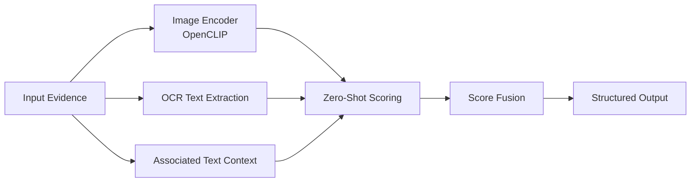

# Hate and Threat Detection in Digital Forensics

[Back to Projects](../projects.md) | [Back to README](../README.md)

## Overview

A multimodal AI pipeline for forensic evidence analysis using image evidence, OCR text, associated textual context, zero-shot classification, and score-level fusion.

## Problem

Digital forensic evidence may include screenshots, images, embedded text, surrounding context, or combinations of modalities. A single text-only or image-only model can miss important signals when evidence is noisy or incomplete.

## What I Built

- Built a modality-aware pipeline for image-only, OCR-based, and image-plus-context evidence analysis
- Used OpenCLIP and transformer-based zero-shot classification
- Added frozen labels, structured outputs, and reproducible experiment scripts
- Designed score-level fusion to combine evidence from multiple modalities
- Organized the project for repeatable evaluation and clearer forensic AI experimentation

## Architecture

## Tech Stack

Python, OpenCLIP, Hugging Face Transformers, OCR, pandas, pytest.

## Repository

[Hate-and-Threat-Detection-in-Forensics](https://github.com/CS-Ponkoj/Hate-and-Threat-Detection-in-Forensics)
