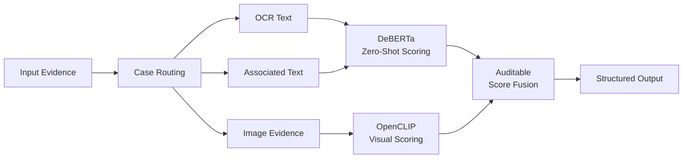

# Hate and Threat Detection in Digital Forensics

[Back to Projects](../projects.md) · [Back to README](../README.md) · [Repository](https://github.com/CS-Ponkoj/Hate-and-Threat-Detection-in-Forensics)

| | |
|---|---|
| **Type** | Public multimodal-AI project |
| **Role** | Designer and developer |
| **Timeline** | Nov 2025–Dec 2025 |
| **Status** | Reproducible public pipeline |

## Problem

Digital-forensic evidence can include screenshots, embedded text, nearby messages, or image-only content. A single text or vision model can miss important signals when evidence is noisy, incomplete, or distributed across modalities.

## System

```mermaid
flowchart LR
    A["Input Evidence"] --> B["Case Routing"]
    B --> C["OCR Text"]
    B --> D["Associated Text"]
    B --> E["Image Evidence"]
    C --> F["DeBERTa<br/>Zero-Shot Scoring"]
    D --> F
    E --> G["OpenCLIP<br/>Visual Scoring"]
    F --> H["Auditable<br/>Score Fusion"]
    G --> H
    H --> I["Structured Output"]
```

## What I Built

- Case-driven routing for OCR, associated-text, and image-only evidence
- OpenCLIP visual scoring and transformer-based zero-shot text classification
- Frozen labels and explicit prompt/model configuration
- Structured intermediate CSV outputs and official fusion output
- Score-level fusion across available modalities
- Repeatable command-line entry points, regression tests, and experiment scripts

## Reproducibility

The repository separates configuration, raw inputs, generated outputs, active pipeline modules, experiments, legacy scripts, and tests. The README documents the exact run order from evidence routing through final fusion.

## Technology

Python, OpenCLIP, Hugging Face Transformers, DeBERTa, Tesseract OCR, pandas, pytest.

## Evidence

- [Public repository](https://github.com/CS-Ponkoj/Hate-and-Threat-Detection-in-Forensics)
- [Related IEEE Big Data publication](https://doi.org/10.1109/BigData52589.2021.9671955)
