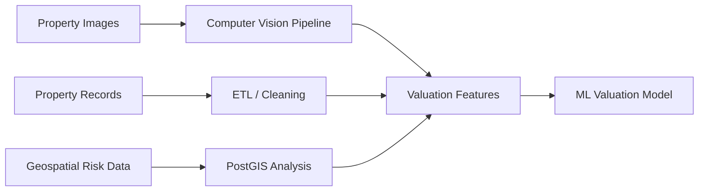

# Production ML and Real Estate Valuation System

[Back to Projects](../projects.md) | [Back to README](../README.md)

## Overview

An end-to-end machine learning system for real estate valuation and property intelligence using computer vision, tabular modeling, geospatial analysis, and cloud infrastructure.

## Problem

Real estate valuation requires combining property records, images, location-based context, and geographical risk factors. The system needed to support large-scale data processing and practical ML workflows.

## What I Built

- Built image classification and valuation pipelines using ResNet152V2 and CatBoost
- Processed 8M+ property images
- Analyzed 4M property records across 100+ geographical risk zones
- Used PostgreSQL and PostGIS for geospatial analytics
- Built cloud data workflows using AWS Lambda, AWS S3, and AWS RDS

## Architecture

## Tech Stack

Python, CatBoost, ResNet152V2, TensorFlow, AWS Lambda, AWS S3, AWS RDS, PostgreSQL, PostGIS.

## Impact

- Processed millions of records and images through production-style ML workflows
- Combined computer vision, tabular modeling, and geospatial analytics for property intelligence
- Built practical cloud pipelines for large-scale data processing
