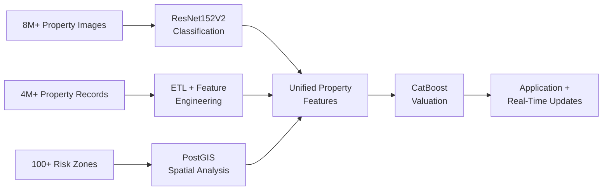

# Property Valuation and Geospatial Risk Platform

[Back to Projects](../projects.md) · [Back to README](../README.md) · [Professional experience](../experience.md#machine-learning-engineer--data-team-lead)

| | |
|---|---|
| **Context** | Production work, Softwrd Ltd |
| **Role** | Machine Learning Engineer / Data Team Lead |
| **Timeline** | Jun 2021–Aug 2022 |
| **Status** | Production and proprietary; architecture and outcomes summarized here |

## Problem

Property intelligence requires combining structured records, millions of images, valuation signals, and location-specific environmental risks. The system needed scalable ingestion, model evaluation, geospatial queries, data-quality controls, and timely result delivery.

## System

```mermaid
flowchart LR
    A["8M+ Property Images"] --> B["ResNet152V2<br/>Classification"]
    C["4M+ Property Records"] --> D["ETL + Feature<br/>Engineering"]
    E["100+ Risk Zones"] --> F["PostGIS<br/>Spatial Analysis"]
    B --> G["Unified Property<br/>Features"]
    D --> G
    F --> G
    G --> H["CatBoost<br/>Valuation"]
    H --> I["Application +<br/>Real-Time Updates"]
```

## What I Built

- CatBoost regression models for property prices and rental values
- ResNet152V2 image-classification workflows for property intelligence
- Feature pipelines, evaluation workflows, and real-time result updates
- Automated ingestion and processing for 8M+ images
- Analysis of 4M+ property records across 100+ geographical risk zones
- PostgreSQL/PostGIS spatial intersections for location-specific risks and advantages
- AWS Lambda, S3, RDS, cloud storage, document-database, and ETL workflows
- Data-quality validation, performance tuning, release improvements, documentation, and production troubleshooting

## Related Workstreams

| Dates | Workstream | Scope |
|---|---|---|
| Nov 2021–Dec 2021 | Risk Report of Norway | Cloud-hosted spatial intersections across environmental and geographic risk layers |
| Jan 2022–Mar 2022 | Automated Valuation Model | CatBoost price and rent modeling on approximately 3M records |
| May 2022–Jun 2022 | Norwegian Mapping Authority Valuation | Boosting-based modeling and multimillion-record cloud/document-database processing |

The approximately 3M-record figure describes the core automated valuation model dataset; 4M+ describes the broader property-record corpus processed across the platform.

## Outcomes

- Contributed to $20K in government funding
- Produced valuation results that exceeded Zillow benchmarks
- Supported large-scale, repeatable ML and geospatial processing in production
- Led data-science workstreams and mentored team members

## Technology

Python, CatBoost, ResNet152V2, TensorFlow, AWS Lambda, AWS S3, AWS RDS, PostgreSQL, PostGIS, MongoDB, ETL pipelines.

## Evidence and Confidentiality

The production source and datasets are proprietary. This case study documents the architecture, personal ownership, scale, and outcomes without exposing employer code or confidential data.
